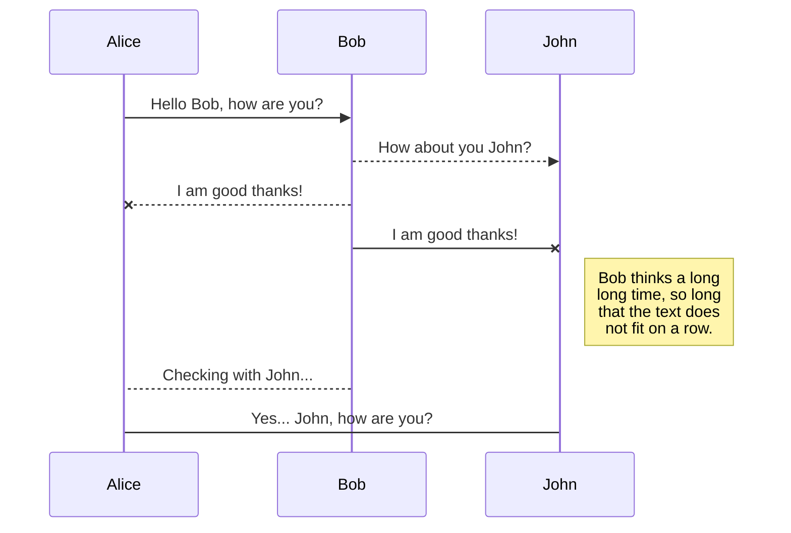
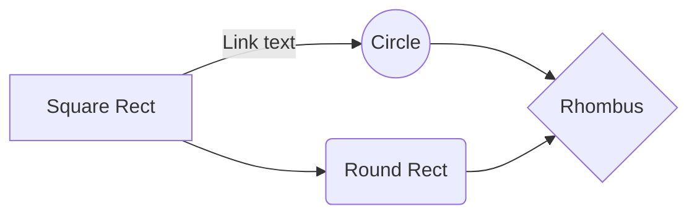

# Sneak.nl

Sneak.nl is de makkelijkste manier om de schoenen te krijgen die jij nodig hebt, direct geleverd tot aan jouw deur. Of het nu voor jezelf is, je vader of zelfs een vere kennis. Jij bepaald hoeveel schoenen je per jaar nodig hebt, welke maat en zelfs welke style's!

# Wat is er nu uniek aan dit concept?

Sneak.nl is de eerste webwinkel in Nederland die  u **maandelijks** voorziet van uw sneakers. Wij zorgen er altijd voor dat uw tevreden bent, passen uw sneakers bijvoorbeeld niet? Geen probleem dan kunt uw de sneakers retour sturen en regelen wij een nieuw paar voor u. Zo simpel is het!

## Waar moet dit project aan voldoen?

Sneak.nl zal voorzien worden van onderandere een volledig logo, landingpage, hoe werkt het, mogelijkheid tot een proefabonoment, verzending en retourinformatie, persoonlijk keuze advies, verschillende keuze's in abonomenten, de mogelijk om uw abonoment aan te passen, een werkend besteld process en natuurlijk een het aanmaken van een account. 

## Welke werkprocessen en criteria moet dit project aan voldoen?

**Voeg hier alle werkprocessen in.**

## Hoe gaat onze website eruit zien?

 [Mermaid](https://mermaidjs.github.io/). For example, this will produce a sequence diagram:

And this will produce a flow chart:

